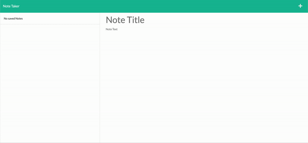
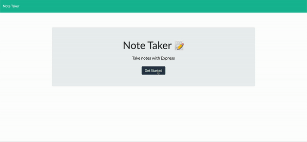

# Note-it-down

## Table of Contents
- [Task](#task)
- [Description](#description)
- [Installations](#installations)
- [Run](#run)
- [GIF](#gif)
- [Website](#website)
- [License](#license)

## Task
The purpose of this task was to create an application called Note Taker that can be used to write and save notes. This application will use an Express.js back end and will save and retrieve note data from a JSON file. The application’s front end and the back end are connected, and then the entire application is deployed to Heroku.

## Description 
Note Taker is an application that allows a user to create notes. There is no limit to number of notes created, once the application is started again the user can view their notes again. The user can also delete the notes.

## Installations
npm install

## Run
node server.js

localhost:3000

deployed on heroku (link under website)

## GIF

  
  
Fig 1: creating notes

   

  
  
Fig 2: fetching the notes and deleting a note 

   

## Website
https://github.com/gmadnani/Note-it-down

## License
[MIT](https://choosealicense.com/licenses/mit/)